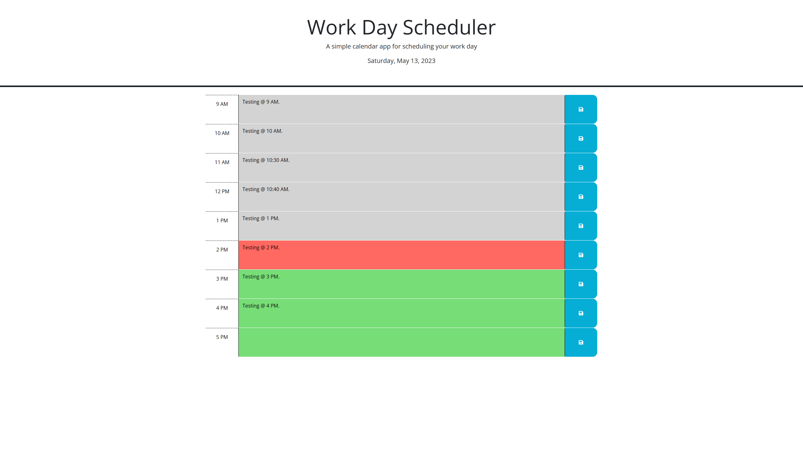

# Work Day Scheduler

## Description
Simple calendar application that allows a user to save events for each hour of the day. This app will run in the browser and keep persistent memory of the scheduled work day. As seen in the screenshot taken at 2 p.m., time blocks of past hours are gray, the time block of the current hours is red, and time blocks of future hours are green.

## Screenshots

## Deploy
https://ricguer.github.io/work-day-scheduler/
